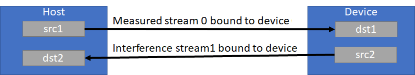
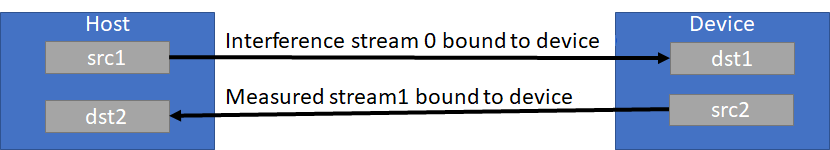

# nvbandwidth
A tool for bandwidth measurements on NVIDIA GPUs.

Measures bandwidth for various memcpy patterns across different links using copy engine or kernel copy methods.
nvbandwidth reports current measured bandwidth on your system. Additional system-specific tuning may be required to achieve maximal peak bandwidth.

## Requirements
nvbandwidth requires the installation of a CUDA toolkit and some additional Linux software components to be built and run. This section provides the relevant details
Install a cuda toolkit (version 11.X or above). Multinode version requires 12.3 toolkit and 550 driver or above.

Install a compiler package which supports c++17. GCC 7.x or above is a possible option.

Install cmake (version 3.20 or above).
Cmake version 3.24 or newer is encouraged.

Install Boost program options library (More details in the next section)

Ensure that path to nvcc binary (install via toolkit) is available in the $PATH variable on linux systems
In order to run nvbandwidth, the system should have a CUDA enabled GPU and an NVIDIA display driver that is compatible with the CUDA Toolkit being used to build nvbandwidth.
For more information, refer to https://docs.nvidia.com/deploy/cuda-compatibility/

## Dependencies
To build and run nvbandwidth please install the Boost program_options library (https://www.boost.org/doc/libs/1_66_0/doc/html/program_options.html).

Ubuntu/Debian users can run the following to install:
```
apt install libboost-program-options-dev
```
On Ubuntu/Debian, we have provided a utility script (debian_install.sh) which installs some generic software components needed for the build.
The script also builds the nvbandwidth project.
```
sudo ./debian_install.sh
```

Fedora users can run the following to install:
```
sudo dnf -y install boost-devel
```

## Build
To build the `nvbandwidth` executable for single-node:
```
cmake .
make
```
You may need to set the BOOST_ROOT environment variable on Windows to tell CMake where to find your Boost installation.

## Usage:
```
./nvbandwidth -h

nvbandwidth CLI:
  -h [ --help ]                  Produce help message
  -b [ --bufferSize ] arg (=512) Memcpy buffer size in MiB
  -l [ --list ]                  List available testcases
  -t [ --testcase ] arg          Testcase(s) to run (by name or index)
  -p [ --testcasePrefixes ] arg  Testcase(s) to run (by prefix))
  -v [ --verbose ]               Verbose output
  -s [ --skipVerification ]      Skips data verification after copy
  -d [ --disableAffinity ]       Disable automatic CPU affinity control
  -i [ --testSamples ] arg (=3)  Iterations of the benchmark
  -m [ --useMean ]               Use mean instead of median for results
  -j [ --json ]                  Print output in json format instead of plain
                                 text.
```
To run all testcases:
```
./nvbandwidth
```

To run a specific testcase:
```
./nvbandwidth -t device_to_device_memcpy_read_ce
```
Example output:
```
Running device_to_device_memcpy_write_ce.
memcpy CE GPU(row) <- GPU(column) bandwidth (GB/s)
          0         1         2         3         4         5         6         7
0      0.00    276.07    276.36    276.14    276.29    276.48    276.55    276.33
1    276.19      0.00    276.29    276.29    276.57    276.48    276.38    276.24
2    276.33    276.29      0.00    276.38    276.50    276.50    276.29    276.31
3    276.19    276.62    276.24      0.00    276.29    276.60    276.29    276.55
4    276.03    276.55    276.45    276.76      0.00    276.45    276.36    276.62
5    276.17    276.57    276.19    276.50    276.31      0.00    276.31    276.15
6    274.89    276.41    276.38    276.67    276.41    276.26      0.00    276.33
7    276.12    276.45    276.12    276.36    276.00    276.57    276.45      0.00
```

Set number of iterations and the buffer size for copies with --testSamples and --bufferSize

## Multinode benchmarks

In order to build multinode version of nvbandwidth, execute

```
cmake -DMULTINODE=1 .
make
```

Multinode nvbandwidth requires MPI. Cmake will find a local installation of MPI to build and link against. Multinode also requires installing, setting up the imex service, and creating the imex channels. Imex service is the NVIDIA Internode Memory Exchange Service. Imex runs on each compute tray to support GPU memory export and import operations across OS domains in an NVLink multi-node deployment. To start the IMEX service, run the following command: 

`sudo systemctl start nvidia-imex.service`
Specify the IP addresses of the cluster nodes in /etc/nvidia-imex/nodes_config.cfg file.

For example, to run multinode bandwidth on a system with 2 nodes and 4 GPUs per node run the command:
`mpirun --allow-run-as-root --map-by ppr:4:node --bind-to core -np 8 --report-bindings -q -mca btl_tcp_if_include enP5p9s0 --hostfile /etc/nvidia-imex/nodes_config.cfg  ./nvbandwidth -p multinode`

### Local testing

You can test it on a single-node machine (Ampere+ GPU required):

```
mpirun -n 4 ./nvbandwidth -p multinode
```
This command will spawn 4 processes, and run all tests with "multinode" prefix.

### Running it on a cluster

To run it on a cluster, submit a job to a workload scheduler that has MPI integration. Run one process per GPU.

Running less processes than GPU count is valid, processes will take consecutive GPUs, starting from GPU 0.

Running more processes than GPU count is not valid.

All ranks in the MPI batch must be part of one multinode clique. Run one instance of nvbandwidth per node/GPU.

When running under MPI, only MPI rank 0 will output stdout to the console. Stderr, if needed, will be output by all processes.

It is recommended to only run "multinode*" testcases under MPI. While any testcase will succeed, results for non multinode testcases will only come from MPI rank 0.

## Test Details
There are two types of copies implemented, Copy Engine (CE) or Steaming Multiprocessor (SM)

CE copies use memcpy APIs. SM copies use kernels.

SM copies will truncate the copy size to fit uniformly on the target device to correctly report the bandwidth. The actual byte size for the copy is:
```
(threadsPerBlock * deviceSMCount) * floor(copySize / (threadsPerBlock * deviceSMCount))
```

threadsPerBlock is set to 512.

### Measurement Details


A blocking kernel and CUDA events are used to measure time to perform copies via SM or CE, and bandwidth is calculated from a series of copies.

First, we enqueue a spin kernel that spins on a flag in host memory. The spin kernel spins on the device until all events for measurement have been fully enqueued into the measurement streams. This ensures that the overhead of enqueuing operations is excluded from the measurement of actual transfer over the interconnect. Next, we enqueue a start event, certain count of memcpy iterations, and finally a stop event. Finally, we release the flag to start the measurement.

This process is repeated 3 times, and the median bandwidth for each trial is reported.

Number of repetitions can be overriden using the --testSamples option, and in order to use arithmetic mean instead of median you can specify --useMean option.

### Unidirectional Bandwidth Tests
```
Running host_to_device_memcpy_ce.
memcpy CE CPU(row) -> GPU(column) bandwidth (GB/s)
          0         1         2         3         4         5         6         7
0     26.03     25.94     25.97     26.00     26.19     25.95     26.00     25.97
```

Unidirectional tests measure the bandwidth between each pair in the output matrix individually. Traffic is not sent simultaneously.

### Bidirectional Host <-> Device Bandwidth Tests
```
Running host_to_device_bidirectional_memcpy_ce.
memcpy CE CPU(row) <-> GPU(column) bandwidth (GB/s)
          0         1         2         3         4         5         6         7
0     18.56     18.37     19.37     19.59     18.71     18.79     18.46     18.61
```

The setup for bidirectional host to device bandwidth transfer is shown below:


**CE copies**  
Stream 0 (measured stream) performs writes to the device, while the interfering stream in the opposite direction produces reads. This pattern is reversed for measuring bidirectional device to host bandwidth as shown below.




**SM copies**  
The test launches a kernel copy where alternating thread warps are copying data in alternating directions.

### Bidirectional Device <-> Device Bandwidth Tests
The setup for bidirectional device to device transfers is shown below:


**CE copies**  
Stream 0 (measured stream) performs writes to the device, while the interfering stream in the opposite direction produces reads. This pattern is reversed for measuring bidirectional device to host bandwidth as shown below.

**SM Copies**  
Similar to the HtoDBidir test above, the test launches a kernel where alternating thread warps copy data in alternating directions.

**Bandwidth calculation**  
CE bidirectional bandwidth tests calculate bandwidth on the measured stream:
```
CE bidir. bandwidth = (size of data on measured stream) / (time on measured stream)
```
However, SM bidirectional test launches a kernel where odd and even warps are copying data in different directions. Bandwidth is calculated as shown below:
```
SM bidir. bandwidth = size/(kernel time);
```
