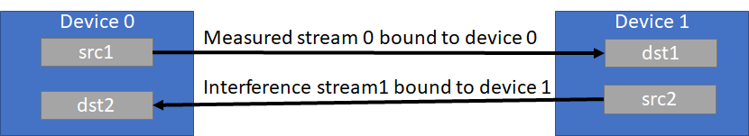

# nvbandwidth
A tool for bandwidth measurements on NVIDIA GPUs.

Measures bandwidth for various memcpy patterns across different links using copy engine or kernel copy methods.
nvbandwidth reports current measured bandwidth on your system. Additional system-specific tuning may be required to achieve maximal peak bandwidth.

## Dependencies
To build and run nvbandwidth please install the Boost program_options library (https://www.boost.org/doc/libs/1_66_0/doc/html/program_options.html).

Ubuntu/Debian users can run the following to install:
```
apt install libboost-program-options-dev
```

## Build
To build the `nvbandwidth` executable:
```
cmake .
make
```
You may need to set the BOOST_ROOT environment variable on Windows to tell CMake where to find your Boost installation.

## Usage:
```
./nvbandwidth -h
nvbandwidth CLI:
  -h [ --help ]          Produce help message
  --bufferSize arg (=64) Memcpy buffer size in MiB
  --loopCount arg (=16)  Iterations of memcpy to be performed
  -l [ --list ]          List available testcases
  -t [ --testcase ] arg  Testcase(s) to run (by name or index)
  -v [ --verbose ]       Verbose output
```

To run all testcases:
```
./nvbandwidth
```

To run a specific testcase:
```
./nvbandwidth -t device_to_device_memcpy_read_ce
```
Example output:
```
Running device_to_device_memcpy_read_ce.
memcpy CE GPU(row) -> GPU(column) bandwidth (GB/s)
          0         1         2         3         4         5         6         7
0      0.00    264.36    263.73    264.17    263.95    263.05    263.71    263.50
1    264.60      0.00    264.82    264.17    264.34    263.95    263.52    263.52
2    263.48    264.38      0.00    264.14    264.17    263.50    263.30    263.52
3    264.17    264.14    263.50      0.00    263.95    263.93    264.17    264.38
4    263.99    264.67    263.99    264.86      0.00    264.86    265.38    264.67
5    263.99    263.78    264.21    264.38    265.14      0.00    264.88    264.84
6    263.99    263.78    263.33    264.45    264.88    264.21      0.00    264.40
7    263.56    264.45    264.21    264.21    265.32    264.67    265.10      0.00
```

Set number of iterations and the buffer size for copies with --loopCount and --bufferSize

## Test Details
There are two types of copies implemented, Copy Engine (CE) or Steaming Multiprocessor (SM)

CE copies use memcpy APIs. SM copies use kernels.

SM copies will truncate the copy size to fit uniformly on the target device to correctly report the bandwidth. The actual byte size for the copy is:
```
(threadsPerBlock * deviceSMCount) * floor(copySize / (threadsPerBlock * deviceSMCount))
```

threadsPerBlock is set to 512.

### Measurement Details


A blocking kernel and CUDA events are used to measure time to perform copies via SM or CE, and bandwidth is calculated from a series of copies.

First, we enqueue a spin kernel that spins on a flag in host memory. The spin kernel spins on the device until all events for measurement have been fully enqueued into the measurement streams. This ensures that the overhead of enqueuing operations is excluded from the measurement of actual transfer over the interconnect. Next, we enqueue a start event, one or more iterations of memcpy, depending on loopCount, and finally a stop event. Finally, we release the flag to start the measurement.

This process is repeated 3 times, and the median bandwidth for each trial is reported.

### Unidirectional Bandwidth Tests
```
Running host_to_device_memcpy_ce.
memcpy CE CPU(row) -> GPU(column) bandwidth (GB/s)
          0         1         2         3         4         5         6         7
0     26.03     25.94     25.97     26.00     26.19     25.95     26.00     25.97
```

Unidirectional tests measure the bandwidth between each pair in the output matrix individually. Traffic is not sent simultaneously.

### Bidirectional Host <-> Device Bandwidth Tests
```
Running host_to_device_bidirectional_memcpy_ce.
memcpy CE CPU(row) <-> GPU(column) bandwidth (GB/s)
          0         1         2         3         4         5         6         7
0     18.56     18.37     19.37     19.59     18.71     18.79     18.46     18.61
```

The setup for bidirectional host to device bandwidth transfer is shown below:


Stream 0 (measured stream) performs writes to the device, while the interfering stream in the opposite direction produces reads. This pattern is reversed for measuring bidirectional device to host bandwidth as shown below.


### Bidirectional Device <-> Device Bandwidth Tests
The setup for bidirectional device to device transfers is shown below:



The test launches traffic on two streams: stream 0 launched on device 0 performs writes from device 0 to device 1 while the interference stream 1 launches opposite traffic performing writes from device 1 to device 0.

CE bidirectional bandwidth tests calculate bandwidth on the measured stream:
```
CE bidir. bandwidth = (size of data on measured stream) / (time on measured stream)
```
However, SM bidirectional test launches memcpy kernels on source and peer GPUs as independent streams and calculates bandwidth as:
```
SM bidir. bandwidth = size/(time on stream1) + size/(time on stream2)
```
